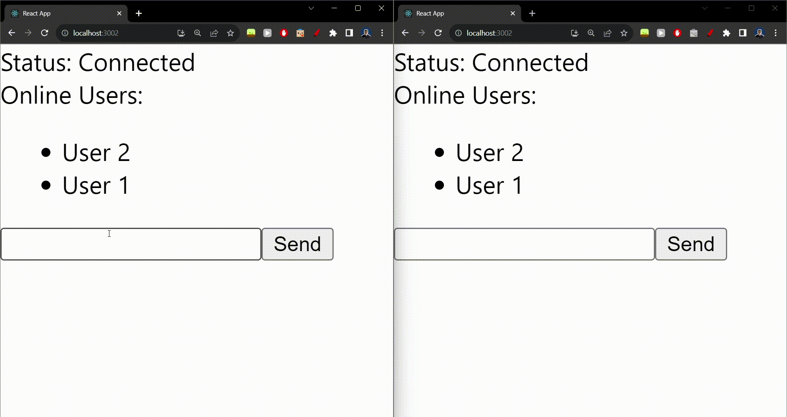

# **SignalR Chat App Demo**

This project demonstrates a simple chat application using SignalR to achieve real-time communication. Users can connect to the chat, view the online users, send messages, and see messages from others in real-time.



## **Features:**

1. **Real-time Chat**: Users can send messages and view incoming messages in real-time.
2. **Connection Status**: Display the connection status (connected, reconnecting, disconnected) to give feedback to the user.
3. **Online Users List**: Display a list of online users. The list gets updated in real-time when a user connects or disconnects.
4. **User Identification**: Messages are prefixed with the sender's identifier, e.g., "User 1".

## **Prerequisites:**

1. **[.NET 5 SDK](https://dotnet.microsoft.com/download/dotnet/5.0)**
2. **[Node.js and npm](https://nodejs.org/)**
3. A code editor like **[Visual Studio Code](https://code.visualstudio.com/)**

## **Installation and Running:**

### **1. Backend (ASP.NET Core)**

Navigate to the backend project directory:

```bash
cd path/to/your/backend
```

Restore the required packages and run the project:

```bash
dotnet restore
dotnet run
```

This will start the backend server on **`http://localhost:5111`**.

### **2. Frontend (React)**

Navigate to the frontend project directory:

```bash
cd path/to/your/frontend
```

Install the required npm packages:

```bash
npm install
```

Then start the React app:

```bash
npm start
```

This will start the frontend on **`http://localhost:3000`** (or a similar available port).

Open your browser and navigate to the frontend URL to start chatting!